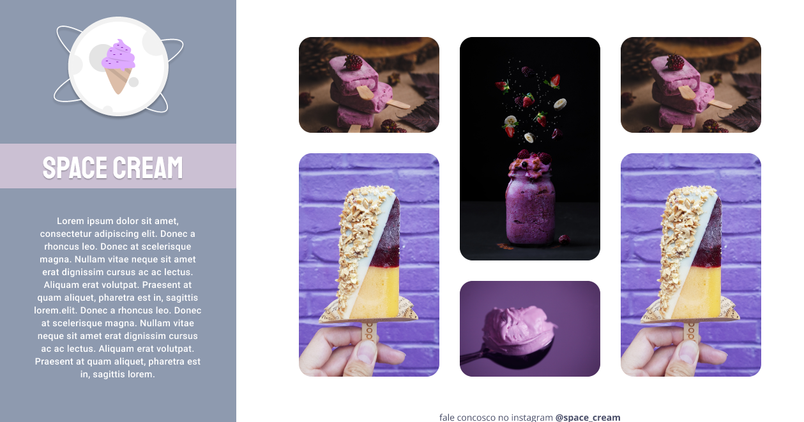

<h1 align="center"> Stage 03 - Challenge Space Cream - EXPLORER </h1>

Challenge developed for completing Module 03 (Advancing in CSS) of the Explorer course - Space Cream application in the desktop version 

  <a href="#-technologies">Technologies</a>&nbsp;&nbsp;&nbsp;|&nbsp;&nbsp;&nbsp;
  <a href="#-project">Project</a>&nbsp;&nbsp;&nbsp;|&nbsp;&nbsp;&nbsp;
  <a href="#-layout">Layout</a>&nbsp;&nbsp;&nbsp;|&nbsp;&nbsp;&nbsp;
 

 

  

## 🚀 Technologies

This project was developed with the following technologies:

- HTML e CSS
- Git e Github
- Figma

## 🔖 Layout

The project layout was developed by Rocketseat instructors as part of the Explorer course. 

## 🪪 License

This project is under the MIT license.

 

by Thalyta Rangel
